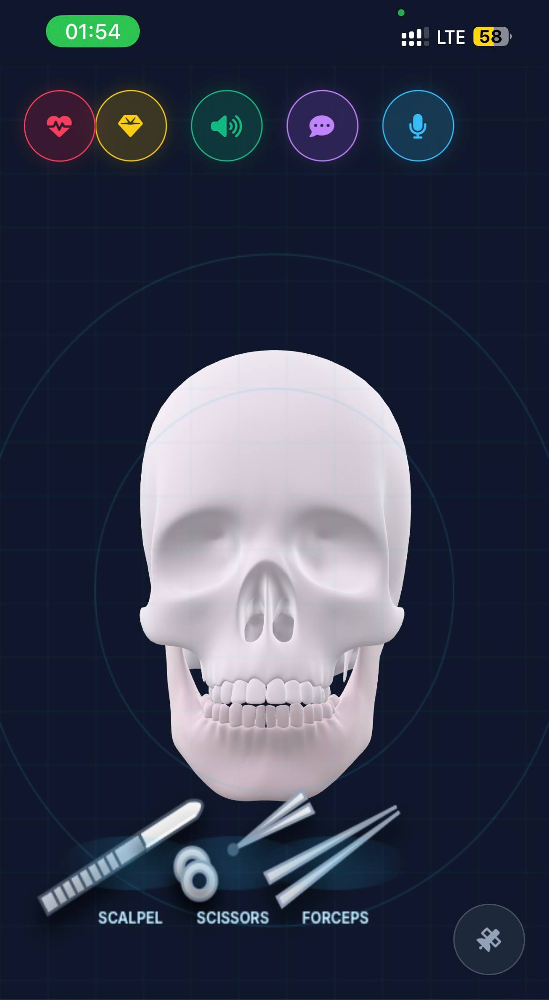
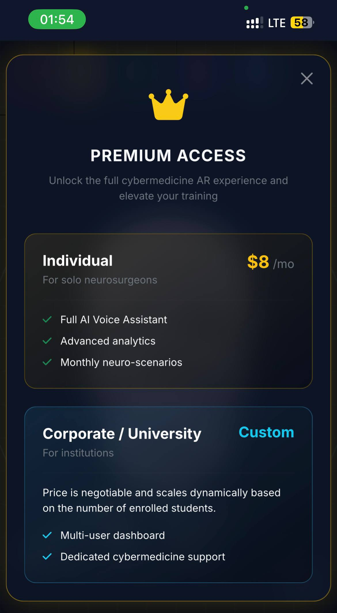
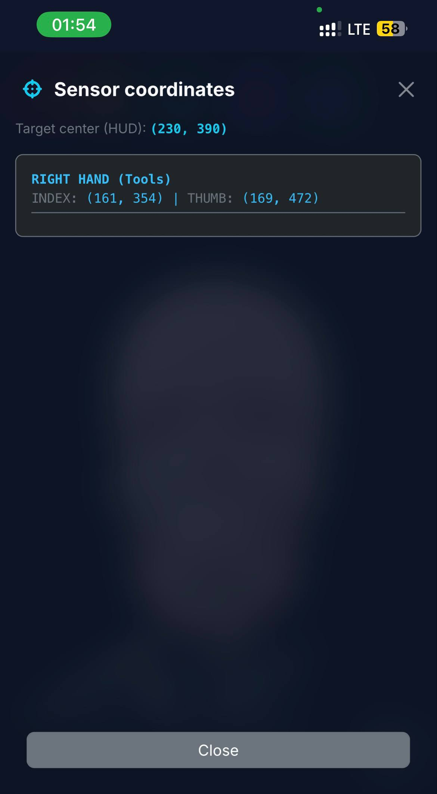

<a id="readme-top"></a>

<!-- PROJECT SHIELDS -->
[![Contributors][contributors-shield]][contributors-url]
[![Forks][forks-shield]][forks-url]
[![Stargazers][stars-shield]][stars-url]
[![Issues][issues-shield]][issues-url]
[![MIT License][license-shield]][license-url]
[![Telegram][telegram-shield]][telegram-url]

<!-- PROJECT LOGO -->
<br />
<div align="center">
  <a href="https://github.com/cursor-uzbekistan/BSMI-leaders">
    
  </a>

<h3 align="center">Surgix AR Neurosurgery HUD</h3>

  <p align="center">
    A highly interactive, browser-based AR Neurosurgery simulation featuring a beautiful cyberpunk-style HUD, state-of-the-art AI voice assistant, 3D model processing, and dual-hand tracking functionality.
    <br />
    <a href="https://github.com/cursor-uzbekistan/BSMI-leaders"><strong>Explore the docs »</strong></a>
    <br />
    <br />
    <a href="https://github.com/cursor-uzbekistan/BSMI-leaders">View Demo</a>
    &middot;
    <a href="https://github.com/cursor-uzbekistan/BSMI-leaders/issues/new?labels=bug&template=bug-report---.md">Report Bug</a>
    &middot;
    <a href="https://github.com/cursor-uzbekistan/BSMI-leaders/issues/new?labels=enhancement&template=feature-request---.md">Request Feature</a>
  </p>
</div>

<!-- TABLE OF CONTENTS -->
<details>
  <summary>Table of Contents</summary>
  <ol>
    <li>
      <a href="#about-the-project">About The Project</a>
      <ul>
        <li><a href="#built-with">Built With</a></li>
        <li><a href="#project-architecture">Project Architecture</a></li>
      </ul>
    </li>
    <li>
      <a href="#getting-started">Getting Started</a>
      <ul>
        <li><a href="#prerequisites">Prerequisites</a></li>
        <li><a href="#installation">Installation</a></li>
      </ul>
    </li>
    <li><a href="#usage">Usage</a></li>
    <li><a href="#roadmap">Roadmap</a></li>
    <li><a href="#contributing">Contributing</a></li>
    <li><a href="#license">License</a></li>
    <li><a href="#contact">Contact</a></li>
    <li><a href="#acknowledgments">Acknowledgments</a></li>
  </ol>
</details>

<!-- ABOUT THE PROJECT -->
## About The Project

<div align="center" style="display: flex; overflow-x: auto; gap: 15px; padding-bottom: 10px;">
  
  
  
</div>

Surgix is an advanced AR cybermedicine application designed to simulate neurosurgical interactions (such as the trepanation of the skull). It acts as a training and showcase tool where users can interact via a live webcam with dual-hand tracking. 

**Key Features:**
*   **Two-Handed PRO Tracking API**: Leverages the `@mediapipe/hands` library fused with `ResNet50` fallback models to track distinct hand landmarks on dual hands concurrently in real-time. Maps index & thumb pinch gestures to grab, rotate, and manipulate surgical tools in a virtual physical space.
*   **Core Architecture via TypeScript**: Provides strong typings for advanced physics processing logic and rendering buffers.
*   **AI Voice Mentor 5.3**: Talk to the HUD naturally! Powered by the latest foundational `5.3` language models to answer specific surgery prompts and interact dynamically. Includes built-in STT (Speech-to-Text) and TTS (Text-to-Speech) modules.
*   **Immersive Cyberpunk UI / UX**: A premium, "glassmorphism" tech HUD design populated with dynamic metrics, animated sensor maps, and interactive physics features like blood splatters.

<p align="right">(<a href="#readme-top">back to top</a>)</p>

### Built With

* [![Bootstrap][Bootstrap.com]][Bootstrap-url]
* [![TypeScript][TypeScript-shield]][TypeScript-url]
* [![JavaScript][JS-shield]][JS-url]
* [![ResNet50][ResNet50-shield]][ResNet50-url]
* [![HTML5][HTML5-shield]][HTML5-url]
* [![MediaPipe][MediaPipe-shield]][MediaPipe-url]
* [![OpenRouter AI][AI-shield]][AI-url]

<p align="right">(<a href="#readme-top">back to top</a>)</p>

### Project Architecture

The project has been heavily modularized to guarantee simple readability, isolated logic testing, and scalable integration. The core `index.html` acts as the primary layout renderer, while all styling and complex JavaScript logic run seamlessly from `/assets`.


  <summary><strong style="font-size: 1.2rem; cursor: pointer;">👉 Click here to expand the File Directory Tree</strong></summary>

```text
/surgix
│
├── index.html              # Main presentation layer. Coordinates DOM, Modals, Canvas and <model-viewer>.
├── README.md               # App documentation.
│
├── 3d_model/               # Dedicated assets folder for high-poly 3D models.
│   ├── cherep.glb          # 3D Skull geometric container (Default entry).
│   └── mozg.glb            # 3D Brain geometric container (Revealed upon success).
│
└── assets/
    ├── css/
    │   └── style.css       # Core stylesheet: Bootstrap overrides, neon HUD layouts, hover physics.
    │
    └── js/
        ├── core.js         # The Brain of the application states. Base configurations, globals.
        ├── audio-ai.js     # Voice-Assistant processor. Handles STT, TTS, and the 5.3 API routes.
        ├── engine.js       # The Heartbeat. Manages 60FPS Game Loop, 2D Canvas rendering, physics.
        ├── tracking.js     # The Eyes. Initializes MediaPipe and ResNet bindings, gestures.
        └── main.js         # The Engine Starter. Links event listeners, handles DOMContentLoaded.
```


<p align="right">(<a href="#readme-top">back to top</a>)</p>

<!-- GETTING STARTED -->
## Getting Started

To get a local copy up and running follow these simple steps. Because this application relies on Web Speech APIs (microphones), camera streaming (`getUserMedia`), and `<model-viewer>` tags, **it cannot be opened directly via `file://` protocol**. You MUST run it on a local server.

### Prerequisites

You need an environment to serve the HTML file over HTTP/HTTPS.
* npm / node
  ```bash
  npm install npm@latest -g
  npm install -g serve
  ```
* python (Alternative)
  Ensure you have python installed natively on your OS.

### Installation

1. Get a free API Key at [https://openrouter.ai](https://openrouter.ai)
2. Clone the repo
   ```bash
   git clone https://github.com/cursor-uzbekistan/BSMI-leaders.git
   ```
3. Navigate into the directory
   ```bash
   cd BSMI-leaders
   ```
4. Drop your 3D models (`cherep.glb` and `mozg.glb`) into the `/3d_model/` folder.
5. Setup TypeScript compilation via NPM (If extending logic):
   ```bash
   npm init -y
   npm install typescript --save-dev
   npx tsc --init
   ```
6. Enter your 5.3 Model API Key in `assets/js/core.js`
   ```js
   let _apiKey = 'ENTER YOUR API KEY HERE';
   ```
7. Spin up the server using NPM:
   ```bash
   npx serve .
   ```
   Or using Python:
   ```bash
   python -m http.server 8000
   ```
8. Open your browser to `http://localhost:3000` (or 8000). Ensure you grant **Camera** and **Microphone** permissions.

<p align="right">(<a href="#readme-top">back to top</a>)</p>

<!-- USAGE EXAMPLES -->
## Usage

* **Initialization:** Click the start button on the cyberpunk intro screen.
* **Hand Tracking:** Show your hands to the camera. The internal `@mediapipe/hands` integration will overlay a skeleton grid on your fingers.
* **Tool interaction:** Close your right index and thumb (Pinch) hovering near the tool locations at the bottom of the screen to grab them. Move your hand to move the cursor. 
* **Rotation:** Use your left hand to pinch and drag, which will rotate the 3D model `<model-viewer>` via changing its `cameraOrbit`.
* **Voice AI Mentor:** Use the UI at the top to click on the microphone toggle, and ask specific medical questions. The 5.3 AI Assistant will respond in a concise professional manner.

<p align="right">(<a href="#readme-top">back to top</a>)</p>

<!-- ROADMAP -->
## Roadmap

- [x] Initial AR HUD architecture and Canvas grid deployment
- [x] Integrate MediaPipe dual-hand gesture models
- [x] Modularize `index.html` structure into `css` and `js` assets
- [x] Implement Web SDK STT & TTS with 5.3 LLM backbone
- [ ] Implement ResNet50 explicit tensor fallback for complex environment tracking
- [ ] TypeScript Full Codebase Migration
- [ ] Multi-lingual Voice Assistant Support

See the [open issues](https://github.com/cursor-uzbekistan/BSMI-leaders/issues) for a full list of proposed features (and known issues).

<p align="right">(<a href="#readme-top">back to top</a>)</p>

<!-- CONTRIBUTING -->
## Contributing

Contributions are what make the open source community such an amazing place to learn, inspire, and create. Any contributions you make are **greatly appreciated**.

If you have a suggestion that would make this better, please fork the repo and create a pull request. You can also simply open an issue with the tag "enhancement".
Don't forget to give the project a star! Thanks again!

1. Fork the Project
2. Create your Feature Branch (`git checkout -b feature/AmazingFeature`)
3. Commit your Changes (`git commit -m 'Add some AmazingFeature'`)
4. Push to the Branch (`git push origin feature/AmazingFeature`)
5. Open a Pull Request

<p align="right">(<a href="#readme-top">back to top</a>)</p>

### Top contributors:

<a href="https://github.com/cursor-uzbekistan/BSMI-leaders/graphs/contributors">
  
</a>

<!-- LICENSE -->
## License

Distributed under the MIT License. See `LICENSE.txt` for more information.

<p align="right">(<a href="#readme-top">back to top</a>)</p>

<!-- CONTACT -->
## Contact

Official Telegram Support - [Prokuratura Buxoro](https://t.me/prokuratura_buxoro)

Project Link: [https://github.com/cursor-uzbekistan/BSMI-leaders](https://github.com/cursor-uzbekistan/BSMI-leaders)

<p align="right">(<a href="#readme-top">back to top</a>)</p>

<!-- ACKNOWLEDGMENTS -->
## Acknowledgments

* [MediaPipe Hands](https://developers.google.com/mediapipe/solutions/vision/hand_landmarker)
* [OpenRouter AI](https://openrouter.ai/)
* [ResNet50 Architecture](https://arxiv.org/abs/1512.03385)
* [Bootstrap](https://getbootstrap.com)

<p align="right">(<a href="#readme-top">back to top</a>)</p>

<!-- MARKDOWN LINKS & IMAGES -->
<!-- https://www.markdownguide.org/basic-syntax/#reference-style-links -->
[contributors-shield]: https://img.shields.io/github/contributors/cursor-uzbekistan/BSMI-leaders.svg?style=for-the-badge
[contributors-url]: https://github.com/cursor-uzbekistan/BSMI-leaders/graphs/contributors
[forks-shield]: https://img.shields.io/github/forks/cursor-uzbekistan/BSMI-leaders.svg?style=for-the-badge
[forks-url]: https://github.com/cursor-uzbekistan/BSMI-leaders/network/members
[stars-shield]: https://img.shields.io/github/stars/cursor-uzbekistan/BSMI-leaders.svg?style=for-the-badge
[stars-url]: https://github.com/cursor-uzbekistan/BSMI-leaders/stargazers
[issues-shield]: https://img.shields.io/github/issues/cursor-uzbekistan/BSMI-leaders.svg?style=for-the-badge
[issues-url]: https://github.com/cursor-uzbekistan/BSMI-leaders/issues
[license-shield]: https://img.shields.io/github/license/cursor-uzbekistan/BSMI-leaders.svg?style=for-the-badge
[license-url]: https://github.com/cursor-uzbekistan/BSMI-leaders/blob/master/LICENSE.txt
[telegram-shield]: https://img.shields.io/badge/Telegram-2CA5E0?style=for-the-badge&logo=telegram&logoColor=white
[telegram-url]: https://t.me/prokuratura_buxoro
[product-screenshot]: https://via.placeholder.com/800x450/020617/38bdf8?text=Surgix+HUD+Screenshot
[Bootstrap.com]: https://img.shields.io/badge/Bootstrap-563D7C?style=for-the-badge&logo=bootstrap&logoColor=white
[Bootstrap-url]: https://getbootstrap.com
[JS-shield]: https://img.shields.io/badge/JavaScript-323330?style=for-the-badge&logo=javascript&logoColor=F7DF1E
[JS-url]: https://developer.mozilla.org/en-US/docs/Web/JavaScript
[TypeScript-shield]: https://img.shields.io/badge/TypeScript-007ACC?style=for-the-badge&logo=typescript&logoColor=white
[TypeScript-url]: https://www.typescriptlang.org/
[ResNet50-shield]: https://img.shields.io/badge/ResNet50-FF6F00?style=for-the-badge&logo=keras&logoColor=white
[ResNet50-url]: https://keras.io/api/applications/resnet/
[HTML5-shield]: https://img.shields.io/badge/HTML5-E34F26?style=for-the-badge&logo=html5&logoColor=white
[HTML5-url]: https://developer.mozilla.org/en-US/docs/Web/HTML
[MediaPipe-shield]: https://img.shields.io/badge/MediaPipe-00B253?style=for-the-badge&logoColor=white
[MediaPipe-url]: https://developers.google.com/mediapipe
[AI-shield]: https://img.shields.io/badge/Model_5.3-000000?style=for-the-badge&logoColor=white
[AI-url]: https://openrouter.ai
